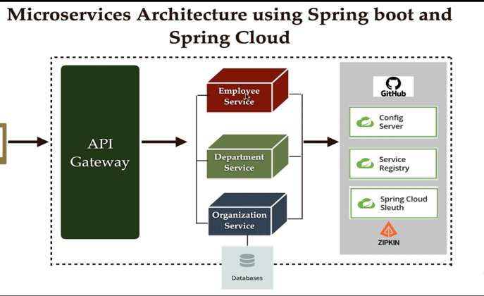
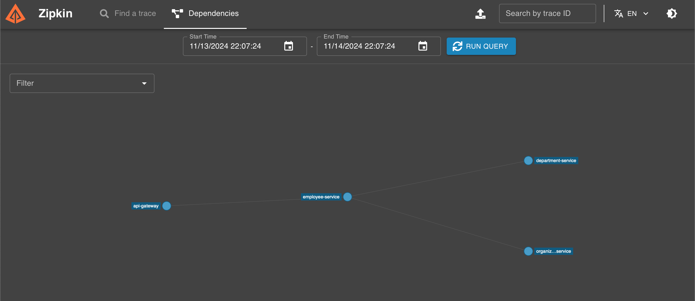

# Spring Boot Microservices
## Description:
A personal project demonstrating working of Spring Boot Microservices.

## Architecture Diagram:

## Microservices:
* Service Registry
* CONFIG-SERVER
* API-GATEWAY
* Organization Service
* Department Service
* Employee Service

## Tech Stack:
* Core Java
* Spring Boot
* Spring Cloud
* Maven
* Hibernate
* MySQL

## ER Diagram:

## Distributed Tracing using Zipkin:

